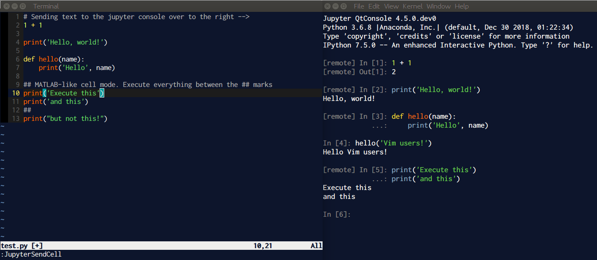

# Jupyter-Vim

A two-way integration between Vim and Jupyter. Develop code on a Jupyter notebooke without leaving the terminal. Send lines from Vim to a jupyter qtconsole. Have a MATLAB-like "cell-mode".

Currently Python and Julia kernels are supported, and more languages are on the way.

[](https://www.youtube.com/watch?v=h59cbg4HqpY)

## Installation of the plugin

To install this plugin, you should use one of the following methods.

On __Windows__, replace in the next sections the Unix directories with the following:

* On __Vim__:
    * `~/.vim` -> `%USERPROFILE%\vimfiles`
    * `~/.vimrc` -> `%USERPROFILE%\_vimrc`

* On __Nvim__:
    * `~/.vim` -> `%USERPROFILE%\AppData\Local\nvim`

Or other directories if you have configured/installed Vim/Nvim differently.

### Vim 8 package manager

```bash
mkdir -p ~/.vim/pack/git-plugins/start
git clone --depth 1 https://github.com/jupyter-vim/jupyter-vim.git ~/.vim/pack/git-plugins/start/jupyter-vim
```

### NeoVim

```bash
mkdir -p ~/.vim/pack/git-plugins/start
git clone --depth 1 https://github.com/jupyter-vim/jupyter-vim.git ~/.vim/pack/git-plugins/start/jupyter-vim
```

### Pathogen

```bash
cd ~/.vim/bundle
git clone https://github.com/jupyter-vim/jupyter-vim.git
```

### Vundle

```vim
Plugin 'jupyter-vim/jupyter-vim'
```

### Vim-Plug

```vim
Plug 'jupyter-vim/jupyter-vim'
```

## Vim+Python configuration

In order for this plugin to work, **you must have Jupyter installed** in the
Python environment that vim's `pythonx` command uses. There are several possible strategies here.

### Install jupyter into system python
When Vim is using your system python (the default on linux), you can just install Jupyter using a package manager. For example, on Ubuntu 18.04 and later:
```bash
$ sudo apt install jupyter jupyter-core
```
Alternatively, you can use `pip`:
```bash
$ sudo pip install jupyter
```

### Dynamic mode
When Vim is compiled with Python in dynamic mode (`+python3/dyn`), you can point to the Python interpreter you wish to use in your `.vimrc`:
```vim
if has('nvim')
    let g:python3_host_prog = '/path/to/python/bin/python3'
else
    set pyxversion=3

    " OSX
    set pythonthreedll=/Library/Frameworks/Python.framework/Versions/3.6/Python

    " Windows
    set pythonthreedll=python37.dll
    set pythonthreehome=C:\Python37
endif
```
Make sure to point it to a Python installation that has Jupyter installed.

### Virtual environments

If either:

* you use a Python environment manager such as `virtualenv`, and thus need
  Jupyter to be present no matter which environment is loaded from the shell
  you open vim from, or
* you only use one Python environment but you don't want to install Jupyter
  system-wide for whatever reason,

then the easiest way to meet the Jupyter requirement is to configure vim to
load a designated virtualenv at startup. This is just to allow vim to call the
Jupyter client; you can run your Jupyter server in whatever Python environment
you want. From Vim, run:
```vim
:pythonx import sys; print(sys.version)
```

This will tell you whether `pythonx` is using Python 2 or Python 3.  (Or, see
`:help python_x` if you'd like to tweak your `pythonx` settings.)  Create a
virtualenv with that python version, for example
```bash
$ virtualenv -p /usr/bin/python2.7 /path/to/my/new/vim_virtualenv
```

or
```bash
$ virtualenv -p /usr/bin/python3 /path/to/my/new/vim_virtualenv
```

and then install Jupyter in that environment:
```bash
$ source /path/to/my/new/vim_virtualenv/bin/activate
$ pip install jupyter
```

Finally, tell vim to load this virtualenv at startup by adding these lines to
your vimrc:
```vim
" Always use the same virtualenv for vim, regardless of what Python
" environment is loaded in the shell from which vim is launched
let g:vim_virtualenv_path = '/path/to/my/new/vim_virtualenv'
if exists('g:vim_virtualenv_path')
    pythonx import os; import vim
    pythonx activate_this = os.path.join(vim.eval('g:vim_virtualenv_path'), 'bin/activate_this.py')
    pythonx with open(activate_this) as f: exec(f.read(), {'__file__': activate_this})
endif
```

## Jupyter configuration
First, we need to configure the jupyter console and qtconsole clients to
display output from other clients.

The config files can be found in in `~/.jupyter`, if they don't exist yet you
can generate them with:
```bash
$ jupyter console --generate-config
$ jupyter qtconsole --generate-config
```

Now you need to uncomment and change the following config options to `True`.

For qtconsole:
```python
c.ConsoleWidget.include_other_output = True
```

For console:
```python
c.ZMQTerminalInteractiveShell.include_other_output = True
```

## Usage

To begin a session:
```bash
$ jupyter qtconsole &  # open a jupyter console window
$ vim <your_script>.py  # a python script must be specified to activate the plugin
```

In vim: `:JupyterConnect`

Then, use `:JupyterRunFile`, or `:[range]JupyterSendRange` to execute lines of
code!

Code will be sent and executed as expected in the graphical `jupyter qtconsole`.
However, in the console version `jupyter console`, the result will only show after you press the `Enter` key.

By default, the following keybindings are defined:
```vim
" Run current file
nnoremap <buffer> <silent> <localleader>R :JupyterRunFile<CR>
nnoremap <buffer> <silent> <localleader>I :PythonImportThisFile<CR>

" Change to directory of current file
nnoremap <buffer> <silent> <localleader>d :JupyterCd %:p:h<CR>

" Send a selection of lines
nnoremap <buffer> <silent> <localleader>X :JupyterSendCell<CR>
nnoremap <buffer> <silent> <localleader>E :JupyterSendRange<CR>
nmap     <buffer> <silent> <localleader>e <Plug>JupyterRunTextObj
vmap     <buffer> <silent> <localleader>e <Plug>JupyterRunVisual

nnoremap <buffer> <silent> <localleader>U :JupyterUpdateShell<CR>

" Debugging maps
nnoremap <buffer> <silent> <localleader>b :PythonSetBreak<CR>
```

Set `let g:jupyter_mapkeys = 0` in your `.vimrc` to prevent the default keybindings from being made.

## Info

Once we fell in love with Vim, we couldn't bear having to jump back and forth
between the ipython/jupyter console and editor anymore. We modeled this simple
interface off of the ideas in
[vim-ipython](https://github.com/ivanov/vim-ipython), but have pared down many
of the features, like the replication of the Jupyter console in a vim buffer,
to make the plugin much more 'lightweight'.

Still a work in progress!

## Troubleshooting

* Make sure that you are running Vim 8 or higher with Python 3 support.
* When on windows, you are probably running 64-bit Python. Make sure you also run a 64-bit version of Vim (the default install is 32-bit!).

### Contributing

Please feel free to raise issues and pull requests on
[the github repository](https://github.com/jupyter-vim/jupyter-vim).

### Credits

We owe significant thanks to the original developer of this plugin:
[Paul Ivanov](https://github.com/ivanov).
It is far easier to update something that already works well than to forge
a new path from scratch.
